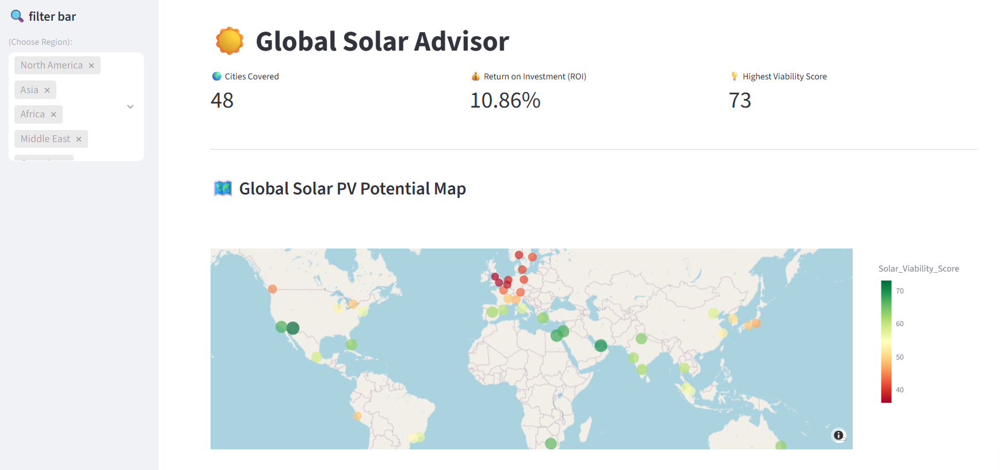

#  Global Solar Energy Decision Support Dashboard

**Author:** Haoyang Qian (Lund University)

##  Project Overview
This is an interactive data visualization dashboard built with **Python** and **Streamlit**. It is designed to assist investors and policy-makers in analyzing the **solar photovoltaic (PV) potential** and **Return on Investment (ROI)** of cities worldwide.

##  Key Features
* **Interactive Map:** Visualize high-potential cities using Plotly Mapbox.
* **Dynamic Filtering:** Filter data by region to analyze specific markets.
* **ROI Calculation:** Automated calculation of investment returns based on environmental data.

##  Dashboard Screenshot

##  Tech Stack & Data
* **Tools:** Python, Streamlit, Pandas, Plotly.
* **Data Source:** [Urban Solar ROI and Sustainability (Kaggle)](https://www.kaggle.com/datasets/shaistashahid/urban-solar-roi-and-sustainability)

##  Note
* **AI Usage:** AI tools were leveraged to accelerate the prototyping process and optimize code structure.
* **Disclaimer:** This project is a prototype for educational and demonstration purposes.